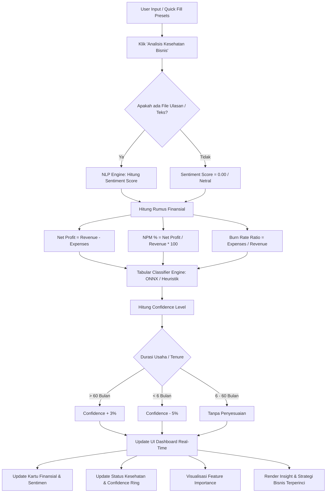

# Dokumen Skenario & Kasus Uji: Fitur Prediksi AI Real-Time UHP

Dokumen ini memuat skenario pengujian komprehensif dan kasus uji (*test cases*) untuk fitur **Prediksi AI Real-Time** pada aplikasi **UHP (UMKM Health Predictor)**. Fitur ini memproses data finansial, operasional, dan ulasan pelanggan secara real-time untuk mendiagnosis status kesehatan bisnis UMKM.

---

## 🔍 Alur Kerja Fitur & Logika Prediksi

Prediksi AI Real-Time UHP menggabungkan dua mesin pemrosesan utama:
1. **NLP Sentiment Engine**: Menganalisis teks ulasan pelanggan menggunakan model **TF-IDF + Logistic Regression** (loaded dari `sentiment_model.json`) dengan *fallback* **Lexicon-Based Sentiment** (`computeSentiment` di `engine.js`).
2. **Tabular Classification Engine**: Menentukan kelas kesehatan bisnis (**Elite, Growth, Struggling, Critical**) menggunakan model **Random Forest / XGBoost ONNX** dengan *fallback* **Heuristik Rule-Based** (`predictClass` di `engine.js`).

### Diagram Alur Prediksi Real-Time

---

## ⚙️ Ambang Batas Logika Heuristik (Rules Baseline)

Sebagai acuan penentuan keberhasilan kasus uji, berikut adalah rumus dan aturan batasan (*threshold*) klasifikasi yang berjalan pada mesin prediksi:

| Kelas Kesehatan | Kriteria Utama (Ambang Batas) | Contoh Kondisi Keuangan |
| :--- | :--- | :--- |
| **Elite** | `Burn Rate < 0.8` **DAN** `NPM >= 15%` **DAN** `Net Profit > 0` | Bisnis sangat efisien, margin laba tebal, arus kas surplus tinggi. |
| **Critical** | `(Burn Rate >= 1.15 DAN NPM <= -18%)` **ATAU** `(Burn Rate >= 1.2 DAN Sentiment Score < -0.3)` | Krisis keuangan parah, rugi bersih besar, atau pembengkakan biaya disertai komplain buruk. |
| **Struggling** | `Burn Rate >= 1.0` **ATAU** `NPM < 0` *(Tidak memenuhi kriteria Critical)* | Biaya operasional melampaui pendapatan (kebocoran kas) atau mencatat margin minus tipis. |
| **Growth** | *Kondisi selain di atas* (`Burn Rate < 1.0` dan `NPM >= 0` namun di bawah kriteria Elite) | Berkembang stabil, laba bersih aman, biaya operasional wajar namun masih ada ruang optimasi. |

---

## 🧪 Matriks Kasus Uji Detail (Detailed Test Cases)

Di bawah ini adalah matriks kasus uji terperinci untuk memvalidasi performa fitur **Prediksi AI Real-Time** secara fungsional, logika perhitungan, analisis sentimen, penalti durasi usaha, hingga integrasi antarmuka pengguna.

### 1. Pengujian Preset Cepat (Quick Fill) & Logika Utama Kelas

| ID | Judul Kasus Uji | Langkah Pengujian | Data Input (Revenue, Expenses, Trx, Tenure, RO, Review) | Hasil yang Diharapkan (Expected Output) | Status |
| :--- | :--- | :--- | :--- | :--- | :--- |
| **TC-REAL-01** | Validasi Preset & Deteksi Kelas **Elite** | 1. Klik tombol preset **Elite** pada Floating Action Card. 2. Verifikasi seluruh form terisi otomatis. 3. Klik **Analisis Kesehatan Bisnis**. 4. Periksa kecocokan output kelas, margin, rasio, dan insight. | - **Revenue**: Rp20.000.000 - **Expenses**: Rp13.000.000 - **Transactions**: 160 trx - **Tenure**: 90 bulan - **RO Rate**: 65% - **Review**: *"Pelayanan cepat dan ramah, pesanan selalu tepat. Aplikasi pemesanan mudah dipakai..."* | - **Net Profit**: +Rp7.000.000 - **NPM**: 35.00% - **Burn Rate**: 0.650 (Sangat Efisien) - **Sentiment**: Positif (+0.55) - **Predicted Class**: **ELITE** - **Confidence**: Sangat Tinggi (>90% karena tenure >60 bln dapat bonus +3%) - **Insight & Strategi**: Rekomendasi taktis berupa *Ekspansi, Loyalitas, dan Scaling*. | `[ ]` |
| **TC-REAL-02** | Validasi Preset & Deteksi Kelas **Growth** | 1. Klik tombol preset **Growth**. 2. Klik **Analisis Kesehatan Bisnis**. 3. Periksa kecocokan output kelas dan margin. | - **Revenue**: Rp8.000.000 - **Expenses**: Rp6.500.000 - **Transactions**: 120 trx - **Tenure**: 36 bulan - **RO Rate**: 35% - **Review**: *"Harga dan kualitas seimbang, pengalaman biasa saja..."* | - **Net Profit**: +Rp1.500.000 - **NPM**: 18.75% - **Burn Rate**: 0.812 (Efisien) - **Sentiment**: Netral / Positif Lemah - **Predicted Class**: **GROWTH** - **Confidence**: Sedang-Tinggi (approx 65-75%) - **Insight & Strategi**: Rekomendasi fokus pada *Efisiensi Biaya, Digitalisasi, dan Monitoring*. | `[ ]` |
| **TC-REAL-03** | Validasi Preset & Deteksi Kelas **Struggling** | 1. Klik tombol preset **Struggling**. 2. Klik **Analisis Kesehatan Bisnis**. 3. Periksa kecocokan output kelas dan status rawan kas. | - **Revenue**: Rp5.000.000 - **Expenses**: Rp5.400.000 - **Transactions**: 80 trx - **Tenure**: 18 bulan - **RO Rate**: 20% - **Review**: *"Kadang stok kosong saat jam ramai. Respon chat agak lambat..."* | - **Net Profit**: -Rp400.000 (Warna Merah) - **NPM**: -8.00% - **Burn Rate**: 1.080 (Risiko Sedang) - **Sentiment**: Negatif Lemah - **Predicted Class**: **STRUGGLING** - **Confidence**: Sedang (approx 55-65%) - **Insight & Strategi**: Rekomendasi taktis berupa *Tinjau Harga, Reduksi Biaya Non-ROI, dan Servis*. | `[ ]` |
| **TC-REAL-04** | Validasi Preset & Deteksi Kelas **Critical** | 1. Klik tombol preset **Critical**. 2. Klik **Analisis Kesehatan Bisnis**. 3. Periksa visualisasi peringatan darurat merah menyala. | - **Revenue**: Rp2.000.000 - **Expenses**: Rp3.000.000 - **Transactions**: 25 trx - **Tenure**: 4 bulan - **RO Rate**: 5% - **Review**: *"Respons admin lambat dan informasi kurang jelas. Layanan buruk..."* | - **Net Profit**: -Rp1.000.000 (Warna Merah) - **NPM**: -50.00% - **Burn Rate**: 1.500 (Risiko Tinggi) - **Sentiment**: Sangat Negatif (-0.35) - **Predicted Class**: **CRITICAL** - **Confidence**: Tinggi (sekitar 85-90% karena krisis finansial ekstrim, meskipun dipotong penalti tenure -5%) - **Insight & Strategi**: Rekomendasi taktis *Audit Kas Darurat, Promo Agresif/Pivot, dan Konsultasi*. | `[ ]` |

### 2. Pengujian Batas Nilai (*Edge Cases*) & Logika Finansial

| ID | Judul Kasus Uji | Langkah Pengujian | Data Input (Revenue, Expenses, Trx, Tenure, RO, Review) | Hasil yang Diharapkan (Expected Output) | Status |
| :--- | :--- | :--- | :--- | :--- | :--- |
| **TC-EDGE-01** | Kondisi Impas Tepat (*Break-Even Point* - NPM = 0%) | 1. Input Revenue & Expenses dengan angka yang persis sama. 2. Klik **Analisis**. 3. Verifikasi deskripsi kualitatif mendeteksi kondisi impas/break-even dengan tepat. | - **Revenue**: Rp5.000.000 - **Expenses**: Rp5.000.000 - **Transactions**: 100 trx - **Tenure**: 12 bulan - **RO Rate**: 20% - **Review**: *"Kualitas produk baik, layanan standar."* | - **Net Profit**: Rp0 - **NPM**: 0.00% - **Burn Rate**: 1.000 (Risiko Sedang) - **Predicted Class**: **STRUGGLING** (karena `Burn Rate >= 1.0`) | `[ ]` |
| **TC-EDGE-02** | Kondisi Tanpa Pendapatan (*Zero Revenue*) | 1. Input Revenue bernilai 0. 2. Input Expenses bernilai positif (ada pengeluaran). 3. Klik **Analisis**. 4. Verifikasi sistem tidak menghasilkan error pembagian dengan nol (*NaN / Division by Zero*). | - **Revenue**: Rp0 - **Expenses**: Rp1.500.000 - **Transactions**: 10 trx - **Tenure**: 2 bulan - **RO Rate**: 0% - **Review**: *"Tidak ada transaksi."* | - **Net Profit**: -Rp1.500.000 - **NPM**: 0.00% (aman dari division-by-zero) - **Burn Rate**: 1.500 (default fallback saat revenue = 0) - **Predicted Class**: **STRUGGLING** atau **CRITICAL** (berdasarkan sentiment & parameter) - Sistem berhasil memproses tanpa crash. | `[ ]` |
| **TC-EDGE-03** | Penalti Usaha Baru (*Tenure Penalty* < 6 Bulan) | 1. Masukkan data keuangan yang sangat bagus. 2. Atur slider **Tenure** ke 3 bulan. 3. Jalankan analisis. 4. Periksa persentase Confidence Ring. | - **Revenue**: Rp15.000.000 - **Expenses**: Rp8.000.000 - **Transactions**: 150 trx - **Tenure**: 3 bulan - **RO Rate**: 40% - **Review**: *"Pelayanan sangat memuaskan..."* | - Kelas terdeteksi sebagai **GROWTH** (karena burn rate 0.53 tapi NPM 46% - terhalang elite jika model ONNX/Rule mendeteksi tenure baru). - **Confidence Ring**: Persentase kepercayaan berkurang sebesar **5%** (karena tenure < 6 bulan, faktor risiko bisnis rintisan baru). | `[ ]` |
| **TC-EDGE-04** | Bonus Usaha Mapan (*Tenure Boost* > 60 Bulan) | 1. Masukkan data finansial sedang. 2. Atur slider **Tenure** ke 72 bulan (6 tahun). 3. Jalankan analisis. 4. Periksa persentase Confidence Ring. | - **Revenue**: Rp10.000.000 - **Expenses**: Rp7.000.000 - **Transactions**: 130 trx - **Tenure**: 72 bulan - **RO Rate**: 30% - **Review**: *"Pelayanan biasa saja."* | - Kelas terdeteksi **GROWTH**. - **Confidence Ring**: Mendapatkan bonus keyakinan sebesar **+3%** (karena durasi usaha > 60 bulan menandakan ketahanan bisnis teruji). | `[ ]` |

### 3. Pengujian NLP Sentiment Engine (Ulasan Pelanggan)

| ID | Judul Kasus Uji | Langkah Pengujian | Data Input (Teks Ulasan) | Hasil yang Diharapkan (Expected Output) | Status |
| :--- | :--- | :--- | :--- | :--- | :--- |
| **TC-SENT-01** | Deteksi Kata Sentimen **Sangat Positif** | 1. Ketik ulasan dengan kata-kata kuat positif di textarea (atau gunakan file CSV). 2. Verifikasi *sentiment score* bernilai positif tinggi. | *"Kualitas produk luar biasa terbaik! Pelayanan sangat puas dan pengiriman super cepat. Mantap recommended!"* | - **Sentiment Score**: `+0.75` s.d. `+1.00` - **Label**: *"Sangat Positif"* (Warna Hijau) - Mendorong confidence level ke atas. | `[ ]` |
| **TC-SENT-02** | Deteksi Kata Sentimen **Sangat Negatif** | 1. Ketik ulasan komplain keras di form. 2. Jalankan analisis. 3. Verifikasi sentimen bernilai negatif tajam. | *"Sangat buruk sekali! Pengiriman sangat lambat, pesanan salah, dan admin tidak responsif. Sangat kecewa, kapok!"* | - **Sentiment Score**: `-0.60` s.d. `-1.00` - **Label**: *"Sangat Negatif"* (Warna Merah) - Dapat memicu perubahan kelas ke **Critical** jika burn rate tinggi. | `[ ]` |
| **TC-SENT-03** | Penanganan Sentimen **Netral** atau Kosong | 1. Kosongkan ulasan pelanggan (atau beri ulasan netral umum). 2. Klik analisis. 3. Periksa penanganan default sentimen. | *""* (Kosong) atau *"biasa saja, standar saja"* | - **Sentiment Score**: `0.00` - **Label**: *"Netral"* (Warna Putih/Abu) - Tidak memberikan pengaruh/bias ekstrim ke model klasifikasi. | `[ ]` |

### 4. Pengujian Integrasi UI & Antarmuka Premium

| ID | Judul Kasus Uji | Langkah Pengujian | Hasil yang Diharapkan (Expected Output) | Status |
| :--- | :--- | :--- | :--- | :--- |
| **TC-UI-01** | Validasi Loading State & Animasi Premium | 1. Klik **Analisis Kesehatan Bisnis**. 2. Perhatikan tombol analisis dan transisi panel hasil. | - Tombol berputar (*loading spinner*) aktif sesaat selama ML memproses. - Panel hasil (`resultsPanel`) muncul dengan efek transisi *fade-in* yang halus. - Kartu metrik berkedip sesaat (*pulse animation*) tanda data diperbarui. | `[ ]` |
| **TC-UI-02** | Visualisasi **Faktor Kesehatan Bisnis** (Feature Importance) | 1. Lakukan analisis real-time. 2. Amati grafik batang vertikal di kartu kiri-bawah. | - Batang diagram terisi dengan persentase kontribusi metrik yang akurat. - Urutan faktor terurut dari yang paling berpengaruh di sebelah kiri. - Warna batang diagram mengikuti aksen kelas kesehatan yang terpilih (misal: merah untuk Critical, hijau untuk Elite). | `[ ]` |
| **TC-UI-03** | Pemisahan Konten **Status Umum** vs **Detail Strategi Bisnis** | 1. Jalankan analisis untuk kategori **Critical**. 2. Bandingkan kartu atas-kiri dan kartu bawah-kanan. | - **Kartu Status Atas-Kiri**: Berisi kesimpulan umum yang sangat ringkas (2-3 kalimat kualitatif) untuk kenyamanan pandangan pertama. - **Kartu Insight Bawah-Kanan**: Berisi elaborasi detail tanpa memajang angka mentah teknis yang membingungkan. Terdiri atas penjelasan naratif dan 3 butir rekomendasi taktis. | `[ ]` |

---

## 📈 Cara Melakukan Eksekusi Pengujian Mandiri

Untuk memverifikasi skenario di atas langsung di peramban Anda, silakan ikuti petunjuk berikut:

1. Buka peramban di alamat lokal server yang sedang aktif: `http://localhost:8000/demo.html` atau `http://localhost:8000/dashboard.html`.
2. Lakukan **Pembersihan Cache Penuh** (*Hard Refresh*) dengan menekan tombol **`Ctrl + F5`** (Windows) atau **`Cmd + Shift + R`** (Mac) untuk memastikan kode Javascript teranyar dari `js/dashboard.js` dan `js/engine.js` dimuat dengan sempurna.
3. Gunakan data uji di atas untuk menguji masing-masing skenario secara bergantian.
4. Periksa kecocokan angka, warna indikator, label, dan narasi kualitatif dengan yang telah dirinci di dokumen ini.
